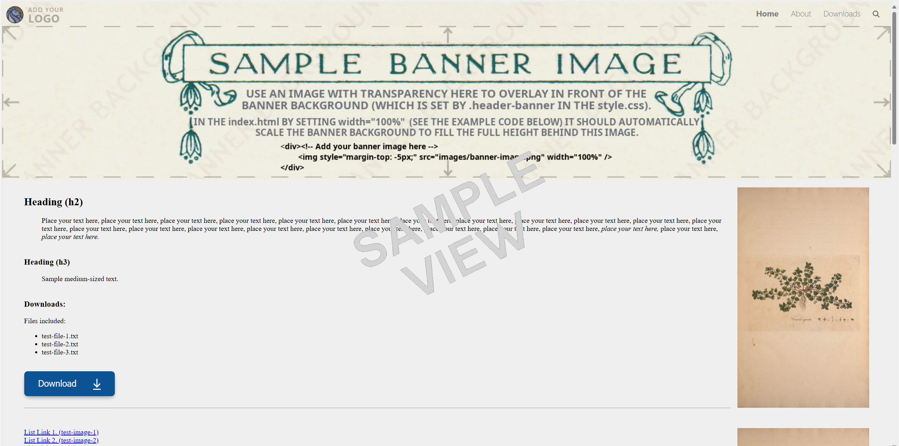

Free HTML/CSS website templates to use on GitHub and elsewhere.

(Click the links below to visit the GitHub repository for each template, where you can try them out and download the free files.)

<table align="center">
    <tr>
        <td align="center">
            <a href="https://github.com/boxbot6/website-template-simple-single-page-v1/">
            
            website-template-simple-single-page-v1.
            </a>
             
               
        </td>   
        <td align="center">
            <a href="https://github.com/boxbot6/website-template-simple-single-page-with-banner-v1/">
            
            website-template-simple-single-page-with-banner-v1.
            </a>
             
               
        </td>   
    </tr>
    <tr>
        <td align="center">
            <a href="https://github.com/boxbot6/simple-website-template-sky-style-v1/">
            
            simple-website-template-sky-style-v1.
            </a>
             
               
        </td>   
        <td align="center">
            <a href="https://github.com/boxbot6/simple-website-template-folder-style-v1/">
            
            simple-website-template-folder-style-v1.
            </a>
             
               
        </td>   
    </tr>
    <tr>
        <td align="center">
            <a href="https://github.com/boxbot6/simple-website-template-with-banner-v1/">
            
            simple-website-template-with-banner-v1.
            </a>
             
               
        </td>   
        <td align="center">
            <a href="https://github.com/boxbot6/simple-website-template-with-banner-v2/">
            
            simple-website-template-with-banner-v2.
            </a>
             
                
        </td>   
    </tr>
    <tr>
        <td align="center">
            <a href="https://github.com/boxbot6/simple-website-template-with-banner-v3/">
            
            simple-website-template-with-banner-v3 (with margins).
            </a>
             
                        
        </td>   
    </tr>
</table>

 

[Click this link to visit the GitHub repository for this site (https://github.com/boxbot6/simple-website-templates).](https://github.com/boxbot6/simple-website-templates)

[Click this link to visit the website being created from the GitHub repository and hosted on github-pages (https://boxbot6.github.io/simple-website-templates).](https://boxbot6.github.io/simple-website-templates/)

 
